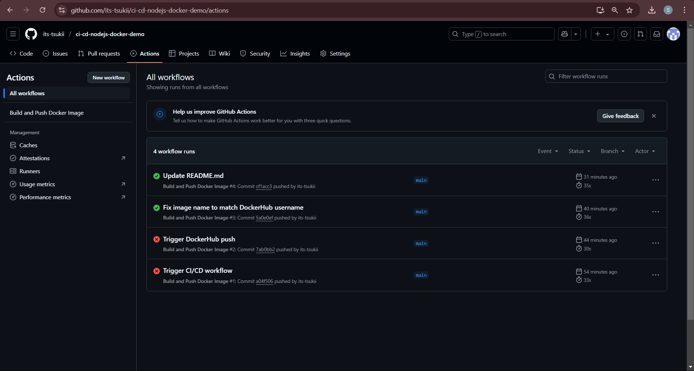

# 🚀 Node.js App CI/CD with Docker & GitHub Actions

[](https://github.com/its-tsukii/ci-cd-nodejs-docker-demo/actions/workflows/main.yml)

This project demonstrates a simple yet powerful DevOps pipeline that:

- Dockerizes a Node.js application
- Builds the Docker image using GitHub Actions
- Pushes the image to Docker Hub automatically on every `push` to the `main` branch

---

## 📦 Docker Image

👉 [blackplayer1001/node-app on Docker Hub](https://hub.docker.com/r/blackplayer1001/node-app)

---

## 🛠️ Tech Stack

- Node.js
- Docker
- GitHub Actions (CI/CD)
- Docker Hub

---

## 📁 Project Structure

. ├── .github 
  <br>│ └── workflows 
  <br>│ └── docker-publish.yml # CI/CD Workflow file 
  <br>├── Dockerfile # Docker build config 
  <br>├── index.js # Main application file 
  <br>├── package.json 
  <br>└── README.md


---

## ⚙️ How It Works

1. On every push to the `main` branch:
   - GitHub Actions triggers a workflow
   - Builds the Docker image using your `Dockerfile`
   - Logs into Docker Hub using secrets (`DOCKER_USERNAME`, `DOCKER_PASSWORD`)
   - Pushes the image to your Docker Hub repository

2. Done! Your Docker image is live and ready to deploy anywhere.

---

### 📸 Screenshots

#### ✅ Workflow Success


## 🚀 Getting Started Locally

```
# Clone the repo
git clone https://github.com/its-tsukii/ci-cd-nodejs-docker-demo.git
cd ci-cd-nodejs-docker-demo

# Build the Docker image
docker build -t node-app .

# Run the container
docker run -p 3000:3000 node-app

# Open in browser
http://localhost:3000
```
🔐 GitHub Secrets Required
Make sure to add the following secrets in your GitHub repo:
```
Secret Name	Value
DOCKER_USERNAME	your Docker Hub username
DOCKER_PASSWORD	your Docker Hub password/token
```

🙌 Credits
Original code: heroku/node-js-sample

CI/CD and Docker pipeline by @its-tsukii

## ✍️ Author

**Aayush Kukade**

- 🌐 [LinkedIn](https://www.linkedin.com/in/aayushkukade/)
- 📖 [Medium Blog for Task 1](https://medium.com/@sroy10012001/ci-cd-with-github-actions-and-docker-task-1-of-my-devops-internship-16008e3c6d1d)
- 🧭 [30 Days DevOps Internship – Master Blog](https://medium.com/@sroy10012001/my-devops-internship-journey-with-elevate-labs-30-days-of-learning-d7252e409a20)

Bravo Scrolling to the End , Here You Deserve a cookie 🍪
